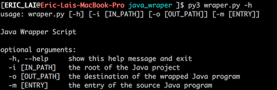
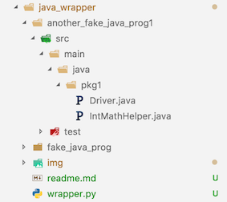
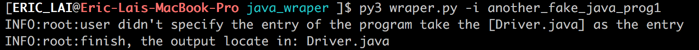
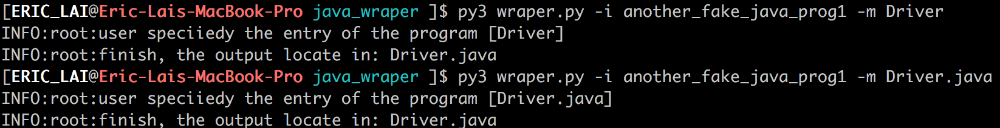
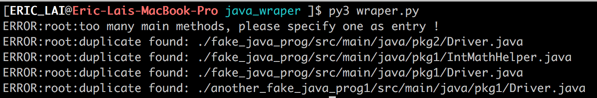
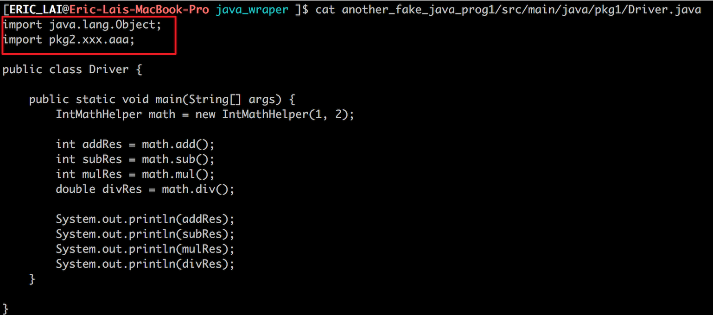
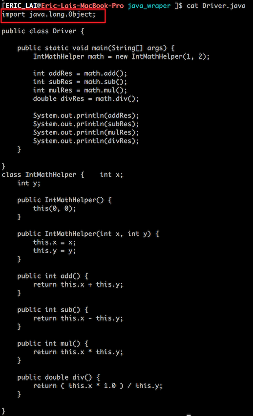

# A Small Java Code Wrapper

**correction: all the `wraper.py` should be replace as `wrapper.py` in the screenshot image**

The `wrapper.py` script can simply wrap your multiple java source files into a single Java source code file.

## How to use?

The usage of the script is simple, but you need to make sure that you have `Python3.0` installed in your local machine.

```
python3 wrapper.py [-i] [java_project_root_dir] [-o] [expected output directory] [-m] [specify where the main method is]
```

Also you can say the following command to find the help message:

```
python3 wrapper.py -h
```



The most easy way to use is following (it will take the directory where the `wrapper.py` is as the first and second parameters, `main` method will be automatically found):

```
python3 wrapper.py
```

## Example Use Case

### Native usage

Assume I have to following project structure:



Now, I want to wrap the `another_fake_java_prog1` as a singe file and put that file in the same folder where `wrapper.py` is. I can use the following command:

```
python3 wrapper.py -i another_fake_java_prog1
```



### Auto Main Detection

Since there is a `main()` method inside `Driver.java`, it will be detected and considered as the entry. Also you can specify the entry if there are many `main()` inside your project, the following two ways are acceptable.



If your program have a top level name conflict, it will be reported:



### Import

Also the script can handle the simple import problem, if the package you try to import is a Java build-in package, it will be put into the generated new file, otherwise, means user defined package, will be discarded.





Finally, we have the generated `Driver.java`, let's try to run it:

```
javac Driver.java
java Driver
```

You should be able to see the result.
